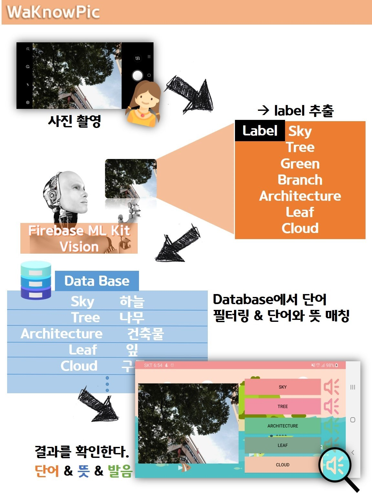
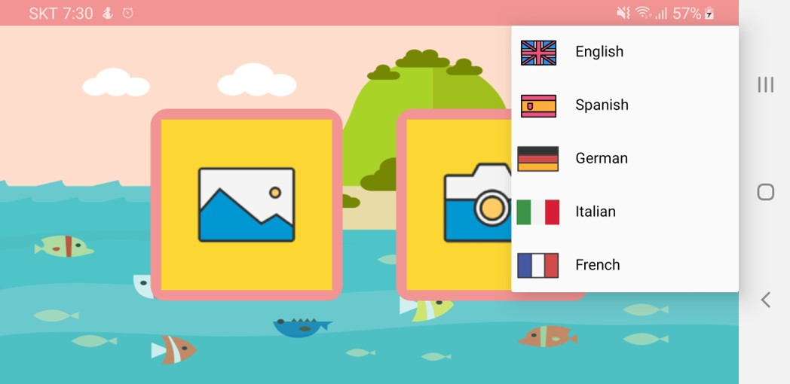
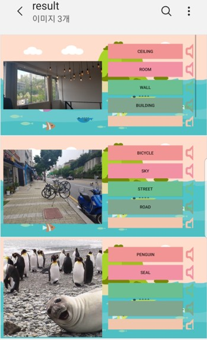

# 20gosu_project

#### 프로젝트 소개
> 사용 기술: Android(Kotlin), Firebase ML kit, Google cloud translate API, Google cloud TTS API\
> 개발 기간: 2019.03.01 ~ 2019.06.05

#### 메인 화면: 언어 선택
> 제공 언어: 영어, 스페인어, 독일어, 이탈리아어, 프랑스어

#### 결과 화면

#### 결과 저장 기능

#### Demo

